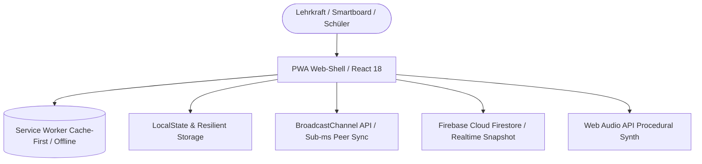

# 🏫 Willkommen im HBS App-Portal
### Staatliche Regelschule „Geschwister Scholl“ Kahla

Das **HBS App-Portal** ist die zentrale, datenschutzkonforme Einstiegs- und Arbeitsplattform für das gesamte Kollegium sowie für Schülerinnen und Schüler der Heimbürgeschule Kahla. Es bündelt alle digitalen Unterrichts-, Organisations- und Verwaltungswerkzeuge an einem einzigen Ort – ohne App-Dschungel, ohne externe Werbe-Tracker und optimiert für interaktive Smartboards, iPads, Tablets und Dienstgeräte.

---

## 📑 Inhaltsverzeichnis

1. [Zugang & Authentifizierung](#1-zugang--authentifizierung)
2. [Ansichts- und Arbeitsmodi](#2-ansichts--und-arbeitsmodi)
3. [Die Unterrichts- & Schultools im Detail](#3-die-unterrichts--und-schultools-im-detail)
   - [HBS Menti (Live-Abfragen & Wortwolken)](#hbs-menti-live-abfragen--wortwolken)
   - [HBS Kahoot! (Gamification, KI-Generator & Notfallblätter)](#hbs-kahoot-gamification-ki-generator--notfallblätter)
   - [HBS Oncoo (Kooperative Lernformen nach Klippert)](#hbs-oncoo-kooperative-lernformen-nach-klippert)
   - [Digitale Tafel (Classroom-Screen-Erweiterung)](#digitale-tafel-classroom-screen-erweiterung)
   - [Übersetzer Schüler & Übersetzer Lehrer](#übersetzer-schüler--übersetzer-lehrer)
   - [Getränkefundus HBS](#getränkefundus-hbs)
   - [Vertretungsstatistik & AZV](#vertretungsstatistik--azv)
   - [Tag in der Praxis (Berufsorientierung)](#tag-in-der-praxis-berufsorientierung)
   - [Projektkompass (Agile Gruppenarbeit)](#projektkompass-agile-gruppenarbeit)
   - [Eltern-Mitmachbogen](#eltern-mitmachbogen)
   - [Landesportale (EduPage, TSP, TSC)](#landesportale-edupage-tsp-tsc)
4. [Integrierte Werkzeuge & Komfortfunktionen](#4-integrierte-werkzeuge--komfortfunktionen)
   - [QR-Code Tischaufsteller-Generator (DIN A4 Faltprisma)](#qr-code-tischaufsteller-generator-din-a4-faltprisma)
   - [Persönliche Linksammlung & Schnellstart-Drawer](#persönliche-linksammlung--schnellstart-drawer)
   - [Admin-Panel für Schulleitung & Admins](#admin-panel-für-schulleitung--admins)
5. [Didaktische Einsatzszenarien im Unterricht](#5-didaktische-einsatzszenarien-im-unterricht)
6. [Technik unter der Haube (Für technisch Interessierte)](#6-technik-unter-der-haube-für-technisch-interessierte)

---

## 1. Zugang & Authentifizierung

Um Ihnen den Zugang so sicher wie möglich und zugleich im Schulalltag so schnell wie möglich zu gestalten, bietet das Portal drei abgestimmte Zugangswege:

* **Kollegiums-Zugang (Empfohlen für Lehrkräfte):**
  Wählen Sie in der Anmeldemaske einfach Ihren Namen aus und geben Sie Ihre persönliche 4-stellige PIN ein. Ihr Arbeitsplatz, Ihre Favoriten, Ihre eigens angelegten Weblinks sowie Ihre Menti- und Kahoot-Entwürfe stehen Ihnen sofort auf jedem Endgerät synchronisiert bereit.
* **Tafel-Gastzugang (Für Smartboards & Gastreferenten):**
  Mit einem Klick auf *„Tafel-Gast“* gelangen Sie ohne Login direkt auf die vollwertige **Digitale Tafel**. Sie müssen an Klassenraum-Smartboards keine privaten Zugangsdaten hinterlassen; nach Unterrichtsende schließen Sie den Browser einfach wieder.
* **Admin-Zugang (Schulleitung & IT-Verantwortliche):**
  Über das Master-Passwort erhalten Administratoren Zugang zur Benutzerverwaltung, zu druckreifen Kollegiums-PIN-Listen, zu Vorlagenfreigaben und zur Cloud-Konfiguration.

---

## 2. Ansichts- und Arbeitsmodi

Über die obere Navigationsleiste können Sie die Darstellung des Portals flexibel an Ihre Unterrichtssituation anpassen:

* **Bento-Raster (Standard):** 
  Moderne Kacheldarstellung mit direkt sichtbaren Kurzanleitungen, didaktischen Tipps und pädagogischem Mehrwert.
* **Kompakt-Ansicht:** 
  Übersichtliche Listenansicht mit schnellen Direktlinks – optimal für Smartphones, schmale Tablets oder die rasche Recherche in Pausen.
* **Smartboard-Beamer-Modus:** 
  Vergrößerte Schaltflächen, kontrastreiche Symbole und maximierte Klickflächen für interaktive Whiteboards und Beamerprojektionen.
* **Kategorienschnellfilter:**
  Wechseln Sie blitzschnell zwischen *„Alle Apps“*, *„Unterricht & Schüler“*, *„Lehrerzimmer & Kollegium“*, *„Schulportale“* oder *„Meine Links“*.

---

## 3. Die Unterrichts- & Schultools im Detail

### HBS Menti (Live-Abfragen & Wortwolken)
*Ein vollwertiger Mentimeter-Klon – 100% datenschutzkonform, werbefrei und ohne Schüler-Accounts.*

* **Folientypen & Interaktionen:**
  * **Wortwolke (Word Cloud):** Schüler senden Begriffe per Smartphone ein. Häufig genannte Wörter wachsen in Echtzeit dynamisch an der Tafel.
  * **Multiple-Choice & Balkendiagramm:** Schnelle Meinungsbilder, Verstehenskontrollen oder Multiple-Choice-Fragen mit animierten Ergebnisbalken.
  * **Skalen (Likert-Scale):** Schüler bewerten Thesen auf Skalen (z. B. 1 bis 5 Sterne/Punkte); das Portal visualisiert den Klassendurchschnitt.
  * **Rangfolge (Ranking):** Schüler sortieren 3 bis 6 Elemente in eine Rangfolge. Das System berechnet per *Borda-Count* automatisch das Gesamt-Ranking der Klasse mit animiertem Siegertreppchen.
  * **2×2 Priorisierungsmatrix:** Schüler platzieren einen Punkt in einem 4-Quadranten-Koordinatensystem (z. B. *Wichtigkeit vs. Dringlichkeit* oder *Interesse vs. Aufwand*). An der Tafel wird der Gesamtschwerpunkt $(\bar{X}, \bar{Y})$ live berechnet.
  * **Quiz-Wettbewerb:** Fragerunden mit Zeitlimit, richtigen Antworten und Live-Rangliste.
* **Kollegiumspool & Ordnersystem:**
  Organisieren Sie Ihre Präsentationen in Ordnern (z. B. *Klasse 7a*, *Vertretung*, *Prüfung*). Mit einem Klick können Sie Folien für das gesamte Kollegium freigeben.
* **1-Klick-Übernahme auf die Tafel:**
  Das Abstimmungsergebnis kann mit einem einzigen Klick direkt als Text- und Diagramm-Widget auf Ihre Digitale Tafel übertragen werden.

---

### HBS Kahoot! (Gamification, KI-Generator & Notfallblätter)
*Echte Quiz-Show-Atmosphäre für den Klassenraum mit integrierter KI-Unterstützung.*

* **Gamification & Beamer-Arena:**
  Fragen laufen auf dem Beamer mit Countdown; Schüler antworten über das bekannte 4-Farben-Gamepad (🔺 Rot, 🔷 Blau, 🟡 Gelb, 🟩 Grün). Ein automatischer Geschwindigkeitsbonus und ein animiertes 3-Stufen-Siegertreppchen sorgen für Begeisterung.
* **Integrierter KI-Quiz-Generator:**
  Geben Sie einfach ein Thema ein (z. B. *„Märchenmerkmale Klasse 5“* oder *„Satz des Pythagoras“*). Die KI generiert in Sekundenschnelle vollständige Fragen mit plausiblen Distraktoren, Erklärungen und Zeitlimits.
* **Team-Modus (Tischgruppen-Spiel):**
  Schüler treten in Tischgruppen an. Zu Beginn jeder Frage läuft eine 5-sekündige Beratungsphase (*„Sprecht euch im Team ab!“*), bevor die Antwortknöpfe freigegeben werden – das verhindert hektisches Tippen und fördert echte Kooperation.
* **Druckbares A4-Notfall-Arbeitsblatt inkl. Lösungsbogen:**
  Sollte das Schul-WLAN ausfallen oder die Stunde von einer Vertretungslehrkraft ohne digitale Geräte übernommen werden, druckt das System das fertige Quiz als Schwarz-Weiß-Arbeitsblatt mit offiziellem HBS-Siegel sowie einen separaten Lösungsbogen für die Lehrkraft.
* **Prozedurale Spielshow-Musik:**
  Integrierter Synthesizer erzeugt während der Fragerunde einen spannungsgeladenen Bass-Loop, Sekunden-Ticks vor Ablauf und feierliche Fanfaren auf dem Treppchen – jederzeit stummschaltbar.

---

### HBS Oncoo (Kooperative Lernformen nach Klippert)
*Die bewährten Methoden für schülerzentriertes, kooperatives Lernen digitalisiert.*

1. **Kartenabfrage (Digitale Pinnwand):**
   Schüler senden farbige Moderationskärtchen (Gelb, Grün, Blau, Rosa, Orange) anonym oder mit Namenskürzel an die Tafel. Lehrkräfte können Spalten anlegen, Karten clustern, die Abfrage sperren und das Gesamtergebnis als **DIN-A4-Druckbogen**, als **Markdown-Dokument** oder direkt auf die **Digitale Tafel** exportieren.
2. **Zielscheibe:**
   Visuelles Feedback zu bis zu 4 Leitfragen. Schüler setzen ihre Punkte auf eine Zielscheibe (Mitte = vollste Zustimmung). Perfekt für Reflexionsphasen und Unterrichtsfeedback.
3. **Lerntempoduett:**
   Löst das Problem unterschiedlicher Arbeitsgeschwindigkeiten: Sobald ein Schüler eine Einzelaufgabe beendet hat, meldet er sich per Klick fertig. Das System paart automatisch die jeweils nächsten beiden fertigen Schüler zu einem Partnertandem mit Tisch-Zuweisung.
4. **Helfersystem (Expertenbörse):**
   Schüler tragen ein, wo sie Hilfe benötigen oder in welchen Aufgabenbereichen sie anderen als Experte zur Seite stehen können.
5. **Placemat (Vier-Ecken-Methode):**
   Vier Schüler arbeiten synchron an den vier Außenecken eines Tisches; im gemeinsamen Mittelfeld wird die Gruppensynthese festgehalten.

---

### Digitale Tafel (Classroom-Screen-Erweiterung)
*Die interaktive digitale Schultafel für den täglichen Unterrichtseinsatz am Smartboard.*

* **26 einsatzbereite Unterrichts-Widgets:**
  * **Zeit & Organisation:** Analoge/Digitale Unterrichtsuhr, Countdown-Timer, Visueller Kuchen-Timer, Stoppuhr, Kalender, Schulstundenplan, Event-Countdown.
  * **Strukturierung & Signale:** Lärmampel (mit Live-Mikrofon-Ausschlag), Verhaltensampel (Rot/Gelb/Grün), Arbeitsphasen-Symbole (Einzelarbeit, Partnerarbeit, Gruppenarbeit, Flüsterphase).
  * **Zufall & Aktivierung:** Zufallsauswahl für Schülernamen, Gruppen-Generator, 3D-Würfel, interaktive Quick-Umfrage (*Poll*), Punktezähler (*Scoreboard*), Motivations-Sticker.
  * **Medien & Dokumente:** Tafeltext-Editor, Freihand-Zeichenfenster, Bildanzeige, Video- & YouTube-Player, PDF-Viewer, Web-Einbettung (*iFrame*) und Weblink-Voransicht.
  * **Kamera & Visualizer:** Nutzen Sie die Webcam oder den USB-Dokumentenkamerastream direkt in einem beweglichen Fenster auf der Tafel.
  * **Tafel-Vorhang & Spotlight:** Schieben Sie schrittweise eine realistische Rollo-Abdeckung über Aufgaben und Lösungen oder lenken Sie mit einem runden Suchscheinwerfer (*Spotlight*) die Aufmerksamkeit auf einzelne Wörter.
* **Handballenschutz (Palm Rejection):**
  Im Zeichen-Widget ignoriert der Stift-Modus aufliegende Handballen auf iPads und Smartboards – nur der Apple Pencil oder Touchpen zeichnet.
* **Globale Undo/Redo-Historie:**
  Versehentlich verschobene, veränderte oder gelöschte Tafelwidgets können Sie mit `Strg + Z` (Mac: `Cmd + Z`) oder per Klick auf die Pfeile in der oberen Leiste wiederherstellen.
* **Tafelbild-Export:**
  Speichern Sie das Tafelbild als hochauflösendes PNG/JPEG, drucken Sie ein strukturiertes DIN-A4-Stundenprotokoll oder teilen Sie das Tafelbild per Live-QR-Code drahtlos auf die Geräte Ihrer Schüler.

---

### Übersetzer Schüler & Übersetzer Lehrer
*Gezielte Sprachmittlung ohne Sprachbarrieren.*
* **Übersetzer Schüler:** Schneller, werbefreier Übersetzer für DaZ-Schülerinnen und Schüler im Fachunterricht. Lässt sich per QR-Code an der Wand sofort auf Schülertablets öffnen.
* **Übersetzer Lehrer:** Ausgestattet mit 2-Wege-Audio, geteiltem Bildschirmmodus und nativer Sprachausgabe für Entwicklungs- und Elterngespräche.

### Getränkefundus HBS
*Die digitale Vertrauenskasse für das Lehrerzimmer.*
Ermöglicht das unkomplizierte Buchen von Kaffee, Erfrischungsgetränken und Snacks sowie die transparente Verwaltung des eigenen Guthabens.

### Vertretungsstatistik & AZV
*Transparenz bei Ausfall- und Vertretungsstunden.*
Dezentrales Lehrerzimmer-Terminal im Kiosk-Modus. Kolleginnen und Kollegen erfassen geleistete Mehrarbeit und Abwesenheiten; die Schulleitung behält den Überblick über Arbeitszeitkonten.

### Tag in der Praxis (Berufsorientierung)
Digitale Begleitung für Praxistage der Regelschüler mit Reflexionsbögen, Kompetenzerfassung und Lehrer-Auswertungsdashboard.

### Projektkompass (Agile Gruppenarbeit)
Ein schülergerechtes Kanban-Board (*Zu erledigen*, *In Arbeit*, *Fertig*). Ein Aufgaben-Zauberstab hilft Schülern, große Referate in kleine Schritte zu zerlegen. Der fertige Statusbericht kann mit einem Klick für EduPage kopiert werden.

### Eltern-Mitmachbogen
Erfasst ehrenamtliche Hilfsangebote, Berufsfelder und Talente der Elternschaft zur Unterstützung von Schulprojekten, Festen und Arbeitsgemeinschaften.

### Landesportale (EduPage, TSP, TSC)
Über die Kachel-Direktlinks gelangen Sie mit einem Klick zu den offiziellen Thüringer Schulsystemen (*EduPage*, *Thüringer Schulportal* und *Thüringer Schulcloud*).

---

## 4. Integrierte Werkzeuge & Komfortfunktionen

### QR-Code Tischaufsteller-Generator (DIN A4 Faltprisma)
Über den Button **„Aufsteller“** in der Kopfzeile oder im Schnellstart-Drawer können Sie mit zwei Klicks druckfertige Dreiecks-Tischprismen erstellen:
* **Vorder- und Rückseite:** Zeigt das offizielle HBS-Siegel, die Tischnummer (z. B. *Tisch 1* bis *Tisch 8*), den QR-Code und eine 3-Schritt-Kurzanleitung. Die Rückseite ist um $180^\circ$ gedreht, sodass Schüler auf beiden Tischseiten den Code aufrecht scannen können.
* **Bodenklappe:** Enthält präzise Falzlinien zum schnellen Zusammenkleben oder Zusammenstecken.
* **Ziele:** Generierbar für das gesamte Portal, Menti-Live, Kahoot-Live, Oncoo-Sitzungen, die Digitale Tafel oder beliebige eigene URLs.

### Persönliche Linksammlung & Schnellstart-Drawer
* **Eigene Links hinzufügen:** Über die Schaltfläche *„Link hinzufügen“* können Sie oft genutzte Fachwebseiten, Lernapps (z. B. *GeoGebra*, *Anton*, *Schlaukopf*) oder Schulportale in Ihrem Profil ablegen.
* **Drag & Drop Sortierung:** Über den Button *„Kacheln anordnen“* schieben Sie Ihre Lieblings-Apps an die gewünschte Position.
* **Schnellstart-Drawer (Seitenleiste):** Ein Klick auf das Menü-Symbol öffnet von rechts eine Werkzeugleiste, mit der Sie aus jeder Anwendung heraus die Tafel starten, Weblinks aufrufen oder PIN-Listen einsehen können.

### Admin-Panel für Schulleitung & Admins
Im geschützten Admin-Bereich können Sie:
* Neue Kolleginnen und Kollegen anlegen oder Zugangs-PINs zurücksetzen.
* Eine druckreife, übersichtliche PIN-Liste für das Lehrerzimmer im PDF-Format generieren.
* Schulweite Menti- und Kahoot-Vorlagen für alle freigeben.

---

## 5. Didaktische Einsatzszenarien im Unterricht

| Unterrichtsphase | Empfohlene Portal-Werkzeuge | Didaktischer Mehrwert |
|---|---|---|
| **Stundenbeginn & Begrüßung** | *Digitale Tafel (Preset „Begrüßung“)* + *HBS Menti (Wortwolke)* | Klare Orientierung durch visualisierte Stundenziele und Stundenplan; sofortige Aktivierung aller Schüler durch anonyme Vorwissensabfrage per Smartphone/iPad. |
| **Erarbeitung (Einzelarbeit)** | *Digitale Tafel (Visueller Kuchen-Timer)* + *Lärmampel* | Schafft Ruhe und Zeitbewusstsein; der Kuchen-Timer zeigt Schülern visuell, wie viel Arbeitszeit verbleibt; die Lärmampel sensibilisiert für die Raumakustik. |
| **Differenzierung & Kooperation** | *HBS Oncoo (Lerntempoduett)* oder *(Helfersystem)* | Schnelle Schüler werden sofort mit passenden Partnern gematcht, ohne Leerlauf; schwächere Schüler finden gezielt Mitschüler-Experten zur Unterstützung. |
| **Gemeinsame Synthese** | *HBS Oncoo (Kartenabfrage)* $\rightarrow$ *Tafel-Export* | Strukturierte Sammlung von Schülerideen; geclusterte Spalten werden per Klick direkt als Text-Widget auf die Digitale Tafel für das gemeinsame Tafelbild übernommen. |
| **Sicherung & Gamification** | *HBS Kahoot! (Team-Modus)* | Spielerische Festigung des Stoffs in Tischgruppen mit 5-Sekunden-Beratungsphase; fördert Teamgeist und Wissensabruf mit hoher Motivation. |
| **Netzausfall / Vertretungsstunde** | *HBS Kahoot! (A4-Notfall-Arbeitsblatt)* | Keine Stunde fällt aus: Mit einem Klick druckt die Vertretungslehrkraft das Quiz als Papiertest inklusive Lösungsbogen aus. |

---

## 6. Technik unter der Haube (Für technisch Interessierte)

Für Kolleginnen und Kollegen, die sich für die moderne Webarchitektur der Anwendung interessieren:

### 1. Moderner Client-Side Tech-Stack
* **React 18 & TypeScript 5:** Vollständig typisierte Komponentenarchitektur für maximale Stabilität und Wartbarkeit.
* **Vite 6 & Code-Splitting:** Schwere Anwendungsmodule (*ClassroomBoard*, *KahootPresenter*, *MentiEditor*, *OncooPresenter*) werden erst via `React.lazy()` und dynamischen Chunks nachgeladen, wenn die jeweilige App geöffnet wird. Das hält das initiale Ladevolumen unter **~705 kB**.
* **Tailwind CSS & Liquid-Glass Design:** Hardware-beschleunigte UI-Effekte, Backdrop-Blur, flüssige Framer-Animationen und volle Reaktionsfähigkeit vom 375px Smartphone bis zum 85-Zoll 4K-Smartboard.

### 2. Duale Echtzeit-Synchronisation (BroadcastChannel + Cloud Firestore)
Um im Schulunterricht ohne merkbare Latenzen abzustimmen, setzt das Portal auf eine duale Pipeline:
* **Lokaler Peer-Sync via `BroadcastChannel API`:**
  Befinden sich Beamer und Schülertablets im selben Browser-/Netzwerkkontext, werden Antworten und Spielzüge ohne Umweg über externe Internet-Server innerhalb von $< 5\text{ ms}$ ausgetauscht.
* **Cloud-Sync via `Google Firebase Firestore`:**
  Für externe Zugriffe (Schüler auf eigenen Smartphones im Mobilfunknetz) synchronisieren reaktive `onSnapshot`-Listener Sitzungszustände in Echtzeit über die verschlüsselte Cloud.

### 3. PWA (Progressive Web App) & Offline-First Resilienz
* **Service Worker (`sw.js`):** Ein nativer Service Worker fängt Netzwerkanfragen ab und nutzt eine *Stale-While-Revalidate*-Strategie. Einmal geladen, startet das Portal auch bei komplettem Netzausfall.
* **Defensiver Storage-Sanitizer:** Ein eigens entwickeltes Schutzmodul (`sanitizeScreens`) prüft alle `localStorage`-Daten auf Korruption und verhindert Browser-Abstürze bei Speicherüberlauf (`QuotaExceededError`).
* **Homescreen-Installation:** Auf iPads und Android-Tafeln kann das Portal per *"Zum Home-Bildschirm"* als eigenständige Vollbild-App ohne störende Browser-Adressleiste installiert werden.

### 4. Prozedurale Web-Audio-Synthese
Zur Erzeugung von Spielshow-Sounds und Countdown-Beats in Kahoot und Menti werden **keine externen MP3-Audiodateien** geladen. Eine eigene Sound-Engine (`classroomAudio.ts`) nutzt die native **Web Audio API** des Browsers und synthetisiert Frequenzen (Sägezahn-Oszillatoren, Biquad-Tiefpassfilter und exponentielle Hüllkurven) rein mathematisch in Echtzeit – 0 kB Ladezeit, keine CDN-Ausfälle.

### 5. Datenschutz & DSGVO-Konformität
* **Keine Schüler-Accounts:** Schülerinnen und Schüler benötigen weder E-Mail-Adressen noch Passwörter oder Registrierungen. Der Beitritt erfolgt rein temporär über 6-stellige PINs oder QR-Codes.
* **Null Werbe- oder Analyse-Tracker:** Es werden keinerlei Drittanbieter-Tracker (wie Google Analytics, Meta Pixel o. Ä.) geladen. Alle Daten verbleiben innerhalb der schuleigenen Firebase-Projektinstanz bzw. lokal auf dem Endgerät.

---

*HBS App-Portal • Staatliche Regelschule „Geschwister Scholl“ Kahla*  
*Entwickelt für zeitgemäßen, motivierenden und verlässlichen Unterricht.*
